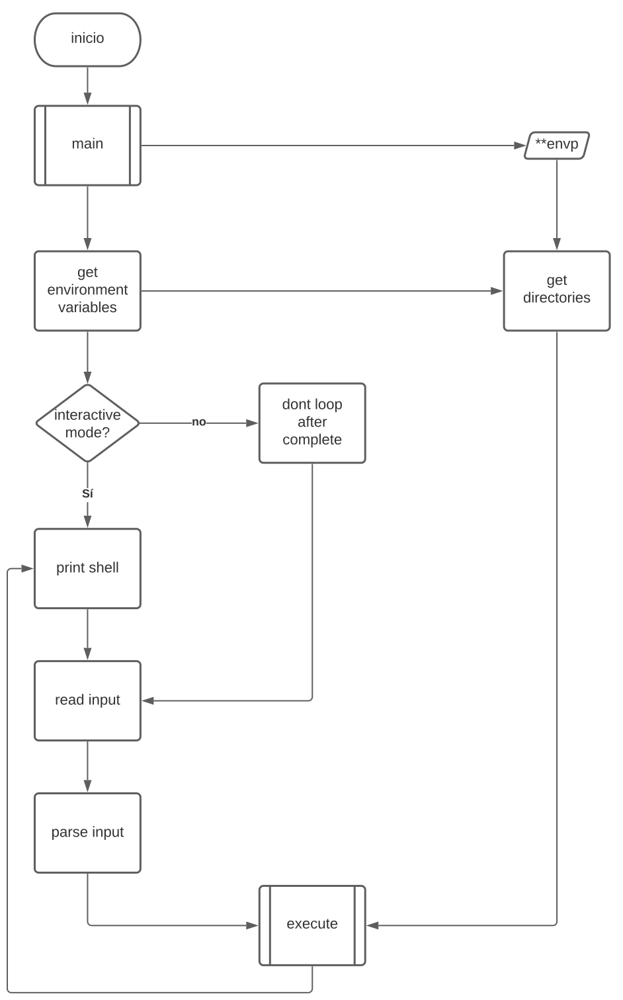
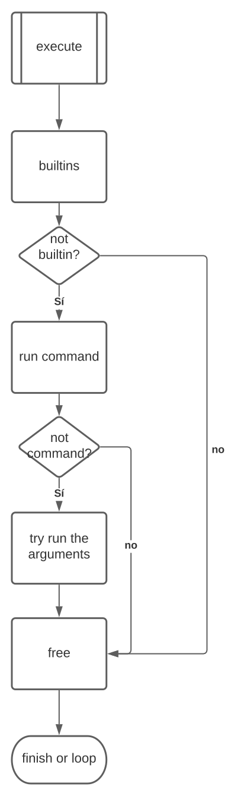

# simple_shell
Simple Unix Shell. Release date August 26, 2021
[](https://twitter.com/intent/tweet?text=Wow:&url=https%3A%2F%2Fgithub.com%2Fralexrivero%2Fsimple_shell)


## Table of Contents

* [Description](#Description)
* [Environment](#Environment)
* [File Structure](#file-structure)
* [Requirements](#requirements)
* [Installation](#installation)
* [Usage](#usage)
* [Feature](#features)
* [Workflow](#Workflow)
* [Example of Use](#example-of-use)
* [Bugs](#bugs)
* [Staff](#staff)
* [License](#license)

## Description

simple_shell is a command interpreter that uses funtions and system calls to execute programs stored in the O.S.
Standard C functions  and system calls employed for this simple_shell:

- [x] access (man 2 access)
- [x] chdir (man 2 chdir)
<!-- - [ ] close (man 2 close) -->
<!-- - [ ] closedir (man 3 closedir) -->
- [x] execve (man 2 execve)
- [x] exit (man 3 exit)
<!-- - [ ] _exit (man 2 _exit)
- [ ] fflush (man 3 fflush) -->
- [x] fork (man 2 fork)
- [x] free (man 3 free)
<!-- - [ ] getcwd (man 3 getcwd) -->
- [x] getline (man 3 getline)
<!-- - [ ] getpid (man 2 getpid) -->
- [x] isatty (man 3 isatty)
<!-- - [ ] kill (man 2 kill) -->
- [x] malloc (man 3 malloc)
<!-- - [ ] open (man 2 open)
- [ ] opendir (man 3 opendir) -->
- [x] perror (man 3 perror)
<!-- - [ ] read (man 2 read)
- [ ] readdir (man 3 readdir) -->
- [x] signal (man 2 signal)
<!-- - [ ] stat (__xstat) (man 2 stat)
- [ ] lstat (__lxstat) (man 2 lstat)
- [ ] fstat (__fxstat) (man 2 fstat) -->
- [x] strtok (man 3 strtok)
- [x] wait (man 2 wait)
<!-- - [ ] waitpid (man 2 waitpid)
- [ ] wait3 (man 2 wait3)
- [ ] wait4 (man 2 wait4) -->
- [x] write (man 2 write)

## Environment

<!-- ubuntu -->
<a href="https://ubuntu.com/" target="_blank"> </a>
OS: Ubuntu 20.04 LTS
<!-- bash -->
<a href="https://www.gnu.org/software/bash/" target="_blank"> </a>
<!-- c -->	<a href="https://www.cprogramming.com/" target="_blank"></a>
Language: C
Compiler: gcc 9.3.0
<!-- vim -->
<a href="https://www.vim.org/" target="_blank"> </a>
Editor: VIM 8.1.2269
<!-- git -->
<a href="https://git-scm.com/" target="_blank"> </a>
Control version: Git
<!-- github -->
<a href="https://github.com" target="_blank"> </a>

Style guidelines: [Betty style](https://github.com/holbertonschool/Betty/wiki)

## File Structure

* **Files with general information about the program:**
	* [LICENSE](LICENSE) - Terms of license to use this project
	* [AUTHORS](AUTHORS) - List of contributors to this repository.
	* [man_simple_shell](man_simple_shell) - Manual page for the simple_shell

* **/img dir:**
	* [img](/img) - directory with support images for README.md

* **Header file with all prototypes function:**
	* [shell.h](shell.h) - Header file with fuction prototypes
* **strings:**
	* [s_putchar.c](s_putchar.c) - print a character
	* [s_puts.c](s_puts.c) - write a string
	* [s_strcat.c](s_strcat) - concatenate two strings
	* [s_strcmp.c](s_strcmp) - compare two strings
	* [s_strcpy.c](s_strcpy) - copy a string to another
	* [s_strlen.c](s_strlen.c) - get length of a string
	* [s_word_count.c](s_word_count.c) - count words in a string
	* [s_worddelimcount.c](s_worddelimcount.c) - count a serie of characters in a string

* **prompt of the shell:**
* [hsh](hsh) - the executable to run the shell
* **Main functions for the life time shell:**

* [hsh_shell.c](hsh_shell.c) - The main function
* [hsh_read_line.c](hsh_read_line.c) - get the input from standard input
* [hsh_execute.c](hsh_execute.c) - launch functions to execute the command
* [hsh_launch_child.c](hsh_launch_child.c) - launch child process
* [hsh_tokenize.c](hsh_tokenize.c) - tokenize the argument line
* [hsh_runcommand.c](hsh_runcommand.c) - run the command if found in the path
* [hsh_set_env.c](hsh_set_env.c) - return the environment variables tokenized
* [hsh_getenv.c](hsh_getenv.c) - get the environment variable
* [hsh_fullpath.c](hsh_fullpath.c) - tokenize the path

* **built-in commands:**
* [b_help.c](b_help.c) - display help
* [b_exit.c](b_exit.c) - exit the shell
* [b_cd.c](b_cd.c) - change the directory

## Installation

- Clone this repository: `git clone "https://github.com/ralexrivero/simple_shell"`
- Change directories into the repository: `cd simple_shell`
- Compile: `gcc -Wall -Werror -Wextra -pedantic *.c -o hsh`
- Run the shell in interactive mode: `./hsh`
- Or run the shell in non-interactive mode: example `echo "Hello world!" | ./hsh`

## Usage

The simple_shell is designed to execute commands in a similar manner to sh, (see man page for complete information on usage):

## Workflow
<!-- iframes does not supported, use only svg with relative path -->



## Features

- [x] uses the PATH
- [x] implements builtins
- [x] handles command line arguments
<!-- - [ ] custom strtok function
- [ ] uses exit status -->
- [x] shell continues upon Crtl+C (**^C**)
<!-- - [ ] handles comments (#)
- [ ] handles **;**
- [ ] custom getline type function
- [ ] handles **&&** and **||**
- [ ] aliases
- [ ] variable replacement -->

## Builtins

- [x] exit - exit the shell
<!-- - [ ] env
- [ ] setenv
- [ ] unsetenv -->
- [x] cd - change directory
- [x] help - display help
<!-- - [ ] history -->

## Example of Use
First compile and then run the executable file on your terminal
For compile see [Installation](#installation) section

```
$ ./hsh
$
$ ls -l
total 22
-rwxrwxrwx 1 user user   206 Aug 23 21:11 AUTHORS
-rwxrwxrwx 1 user user   479 Aug 25 11:31 b_cd.c
-rwxrwxrwx 1 user user   190 Aug 25 11:31 b_exit.c
-rwxrwxrwx 1 user user   585 Aug 25 11:31 b_help.c
-rwxrwxrwx 1 user user  1131 Aug 25 11:35 hsh_execute.c
-rwxrwxrwx 1 user user   727 Aug 25 11:55 hsh_launch_child.c
-rwxrwxrwx 1 user user   426 Aug 25 11:49 hsh_read_line.c
-rwxrwxrwx 1 user user   711 Aug 25 12:17 hsh_shell.c
-rwxrwxrwx 1 user user  1301 Aug 25 12:04 hsh_tokenize.c
drwxrwxrwx 1 user user     0 Aug 23 21:11 img
-rwxrwxrwx 1 user user 11357 Aug 23 21:11 LICENSE
-rwxrwxrwx 1 user user  1091 Aug 23 21:11 man_1_simple_shell
-rwxrwxrwx 1 user user  6471 Aug 25 12:44 README.md
-rwxrwxrwx 1 user user   749 Aug 25 11:30 shell.h
drwxrwxrwx 1 user user  4096 Aug 24 20:03 simple_shell_03
-rwxrwxrwx 1 user user   183 Aug 25 11:30 s_putchar.c
-rwxrwxrwx 1 user user   339 Aug 25 10:04 s_puts.c
-rwxrwxrwx 1 user user 16784 Aug 25 10:56 s_strcat
-rwxrwxrwx 1 user user   628 Aug 25 10:57 s_strcat.c
-rwxrwxrwx 1 user user   325 Aug 25 10:02 s_strcmp.c
-rwxrwxrwx 1 user user   282 Aug 25 10:02 s_strlen.c
-rwxrwxrwx 1 user user   276 Aug 25 12:14 s_word_count.c
```
## Bugs

Not known bugs at the moment

## Staff
Ayrton & Fabiana & Ronald

Ayrton

<a href="https://www.linkedin.com/in/ayrton-coelho-b91824170/" target="_blank">   </a>

<a href="https://github.com/hippocampus3282/" target="_blank">   </a>
<br/>

Fabiana

<a href="https://www.linkedin.com/in/fabiana-tellechea-711316215/" target="_blank">   </a>

<a href="https://github.com/hippocampus3282/" target="_blank">   </a>
<br/>

Ronald

<a href="https://twitter.com/ralex_uy" target="_blank">   </a>

<a href="https://www.linkedin.com/in/ronald-rivero/" target="_blank">   </a>

<a href="https://github.com/ralexrivero/" target="_blank">   </a>

<br/>

## License
This simple_shell is under Apache license. Feel free to contribute to this repo.
